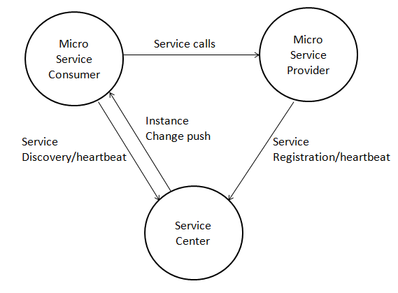
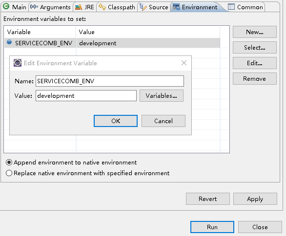

# Local Development and Test  
## Concept Description

This section describes how developers can locally develop and commission consumer and provider applications. Both service providers and consumers need to connect to the remote service center. Two methods of building Local  ServiceCenter for local microservice commissioning are as follows:

* Starting [Local Service Center](#section2945986191314)。

* Starting Local Service Center [Mock mechanism](#section960893593759)。

### Local debugging by setting up environmental information

The Service Center is an important component in the microservice architecture, this is used in managing and handle: registering and discovering, for service metadata and service instance metadata. The logic relationship between the service center and microservice provider/consumer is as follows:

## Starting Local ServiceCenter

* **Step 1** Starting local service center

1. run in executable files  

   <ul class="nav nav-tabs">
     <li data-toggle="tab" class="active"><a data-toggle="tab" href="#windows">Windows</a></li>
     <li data-toggle="tab"><a data-toggle="tab" href="#linux">Linux</a></li>
   </ul>

   <div class="tab-content">
     <div id="windows" class="tab-pane active" markdown="1">
    (1) Download the [Service Registry Executable Compressor] (http://apache.org/dyn/closer.cgi/incubator/servicecomb/incubator-servicecomb-service-center/1.0.0-m1/apache-servicecomb- Incubating-service-center-1.0.0-m1-windows-amd64.tar.gz)  
    (2) Extract to the current folder  
    (3) Go to the unzipped directory and double-click to run the **start-service-center.bat** file.  

      </div>
      <div id="linux" class="tab-pane fade" markdown="1">
    1) Download the Service Registry executable file archive and extract it  
   ```bash
   wget http://apache.org/dyn/closer.cgi/incubator/servicecomb/incubator-servicecomb-service-center/1.0.0-m1/apache-servicecomb-incubating-service-center-1.0.0-m1-linux-amd64.tar.gz
   tar xvf apache-servicecomb-incubating-service-center-1.0.0-m1-linux-amd64.tar.gz
  ```  
   2) Run the service registry  
   ```bash
   Bash apache-servicecomb-incubating-service-center-1.0.0-m1-linux-amd64/start-service-center.sh
   ```  
   
    Note: The frontend (frontend) will be bound to the ipv6 address by default in the Linux environment, causing the browser to report an error. The repair method is: first modify the httpaddr in conf/app.conf to the external reachable network card ip, and then modify the app/appList/apiList. .js `ip : 'http://127.0.0.1'` for the corresponding ip, and finally restart ServiceCenter.
  
    </div>
   </div>

   Note: Both Windows and Linux versions only support 64-bit systems.  

2. Run as Docker  

 ```bash
Docker pull servicecomb/service-center
Docker run -d -p 30100:30100 servicecomb/service-center:latest
 ```

* **Step 2 ** After starting the local service center, configure the ServerCenter address and port in the service provider/consumer's microservice.yaml file. Example code:

 ```yaml
Servicecomb:
  Service:
    Registry:
      Address:
        #Service Center address and port
        Http://127.0.0.1:30100
 ```

* **Step 3 **Development service provider/consumer, launch microservices for local testing.

**----End**

## Mock mechanism start service center
Simulate a service center that can only be used by this process in the process memory, which is generally used in the test scenario.
* ### In-process call
Just declare it before starting the ServiceComb engine to enable it:
```java
System.setProperty("local.registry.file", "notExistJustForceLocal");
```
* ### Cross-process call
If the deployment is simple and the deployment information is static, you can use this mock mechanism even if you have a cross-process call.
The producer end is still declared like "in-process call"
However, because the Mock does not work across processes, the Mock on the consumer side needs to provide a local configuration file that describes the details of the call target, including the name, version, address, schema id, etc.
Similarly, because the Mock cannot cross processes, the consumer cannot dynamically obtain the contract information of the producer. Therefore, the contract file needs to be provided locally.
(This scenario, using the Mock Service Center, is much more costly than using a standalone service center, not recommended)

* **Step 1** Create a new local service center definition file, assuming the name is registry.yaml, the content example is as follows:  

* **Step 1** Create a new local service center definition file, assuming the name is registry.yaml, the content example is as follows:

 ```yaml
localserv:
  - id: "100"
    version: "0.0.1"
    appid: localservreg
    schemaIds:
      - hello
    instances:
      - endpoints:
        - rest://localhost:8080
        - highway://localhost:7070
 ```
* **Step 2**consumer local deployment contract file

 Reference: [Define Service Contract] (https://docs.servicecomb.io/java-chassis/zh_CN/build-provider/define-contract.html)
* **Step 3** In the consumer main function, declare the ServiceComb engine before starting:

 ```java
　　System.setProperty("local.registry.file", "/path/registry.yaml");
 ```

The second parameter of setProperty fills in the absolute path of the registry.yaml system on the disk, pay attention to distinguish the corresponding path separator in different systems.


## Local debugging by setting environment information
The java chassis is strictly dependent on the contract when designing, so usually the version of the microservice has to change when the contract updated. However, if the development mode is still in progress, it is normal to modify the interface.   
If you need to change the version every time, it is very unfriendly to the user, so an environment setting is added for this case. If the microservice is configured as a development environment, the interface is modified (the schema has changed), and the restart can be registered to the service center without modifying the version number.  
However, if  consumer client has already called the service before the restart, the consumer client needs to be restarted to get the latest schema. For example, A -> B, B interface has been modified and restarted, then A is still using B last schema at this time, the call may be wrong, so as to avoid unknown exceptions, A also needs to restart. There are three ways to set it up, Recommended method 1  

* Method 1: Set by the JVM startup parameter   
**-Dservice_description.environment=development**

* Method 2: Specify by microservice.yaml configuration file

```yaml
service_description:
  environment: development
```

* Method 3: Specify by environment variable (only for Windows system), such as the following settings under Eclipse

