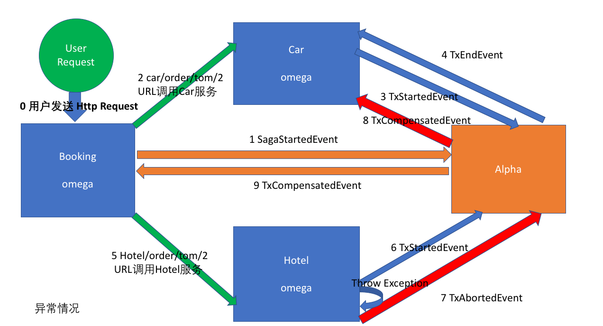
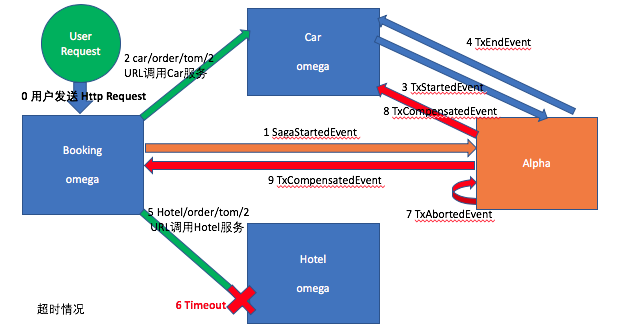
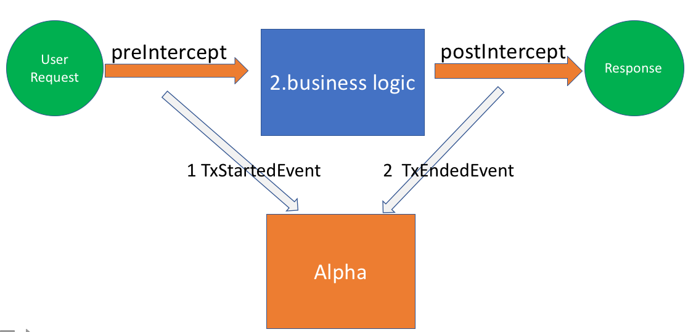

# Apache ServiceComb Pack
Apache ServiceComb Pack QuickStart
saga-servicecomb-demo中的Saga代码解读

* 为了更好的学习Apache ServiceComb Pack，我们设定一个实际需要分布式一致性的业务场景来方便理解，场景中：预定服务Booking、租车订单服务car、和酒店订单服务hotel没有依赖关系，可以并行处理，但对于我们的客户来说，只在所有预订成功后一次付费更加友好。 那么这三个服务的事务关系可以用下图表示：

图中Booking调用Car及Hotel服务，

## Pack Event 介绍
[事件参考代码](https://github.com/apache/servicecomb-pack/blob/master/pack-common/src/main/java/org/apache/servicecomb/pack/common/EventType.java)

SagaStartedEvent 保存整个saga请求，其中包括多个事务/补偿请求
TxStartedEvent 保存对应事务请求
TXEndedEvent 保存对应事务请求及其回复
TxAbortedEvent 保存对应事务请求和失败的原因
TxCompensatedEvent 保存对应补偿请求及其回复
SagaEndedEvent 标志着saga事务请求的结束，不需要保存任何内容

## Demo中的Pack场景
Pack中包含两个组件，即 alpha 和 omega。
图中的三个服务，booking、car、hotel均为omega进程，且通过alpha协调。booking调用car与hotel，且omega像一个agent内嵌其中负责：  
1）对方法调用以切面方式(AOP)拦截并向alpha上报事务事件。  
2）异常情况下根据alpha下发的指令执行相应的补偿操作。  
*异常情况指事务执行失败，或者请求超时等  
而alpha充当协调者的角色，主要负责:  
	(1)对本地事务（子事务）的事件进行持久化存储  
	(2)在本地事务（子事务）与全局事务出现不一致的情况下，Alpha会调用Omega进行相关的补偿，使其得以最终与全局事务的状态保持一致  

成功场景下，全局事务事件SagaStartedEvent对应SagaEndedEvent ，每个子事务开始的事件TxStartedEvent都会有对应的结束事件TXEndedEvent。

异常场景下，omega会向alpha上报中断事件TxAbortedEvent，然后alpha会向该全局事务的其它已成功的子事务(以完成TXEndedEvent)发送补偿指令，确保最终所有的子事务要么都成功，要么都回滚。

超时场景下，已超时的事件会被alpha的定期扫描器检测出来，与此同时，该超时事务对应的全局事务也会被中断。  
                 

1.用户发送Request请求调用业务方法(business logic)
2.preIntercept向alpha发送TxStartedEvent
3.被AOP拦截的方法(business logic)被调用
4.当执行成功时postIntercept发送TxEndedEvent到alpha
5.最后业务方法向用户发送response
基本运行机制清楚了，接下看具体实现的代码:

## 全局事务执行过程
[全局事务参考代码](https://github.com/apache/servicecomb-pack/blob/master/omega/omega-transaction/src/main/java/org/apache/servicecomb/pack/omega/transaction/SagaStartAnnotationProcessor.java)

在SagaStartAnnotationProcessor
Annotation被触发  
1 当用户发出Request发送请求，调用
2 调用preIntercept 发送 SagaStartedEvent 开始事务  
3 调用postIntercept 发送 SagaEndedEvent 事务结束执行  

### EnableOmega解析

[入口标注](https://github.com/apache/servicecomb-pack/blob/master/omega/omega-spring-tx/src/main/java/org/apache/servicecomb/pack/omega/transaction/spring/TransactionAspectConfig.java)
* 当EnableOmega签注生效时TransactionAspectConfig同时被实例化
* TransactionAspectConfig中的sagaStartAspect方法，返回初始化的SagaStartAspect对象。
* SagaStartAspect在构造函数中初始化SagaStartAnnotationProcessor（参数：OmegaContext及SagaMessagerSende） 参考下面的代码： 

[入口标注](https://github.com/apache/servicecomb-pack/tree/master/omega/omega-transaction/src/main/java/org/apache/servicecomb/pack/omega/transaction)

* 当全局事务开始时候
* SagaStartAspect调用preIntercept来发送SagaStartedEvent表示事务的开始
* SagaStartAspect调用postIntercept来发送SagaEndedEvent事件来结束全局事务
* 在SagaStartAspect中会对签注SagaStart的对象发送Sender对象（Sender对象包含 globalTxId及localTxId）
* 在事务执行出现异常的时候会发送TxAbortedEvent并通过反射调用compensationMethod  

## 子事务执行过程

在SagaStartAnnotationProcessor
Annotation被触发  
1 当Request发送请求
2 调用preIntercept发送TxStartedEvent 开始事务   
3 postIntercept 发送 TxEndedEvent 事务结束执行  

### 在CompensableInterceptor中
* AlphaResponse调用TxStartedEvent
* postIntercept发送TxEndedEvent
* 当出现异常情况的时候 onError会发送 TxAbortedEvent事件
通过对@Compensable这个annotation的AOP拦截处理，在本地事务开始与结束时记录saga执行事件
